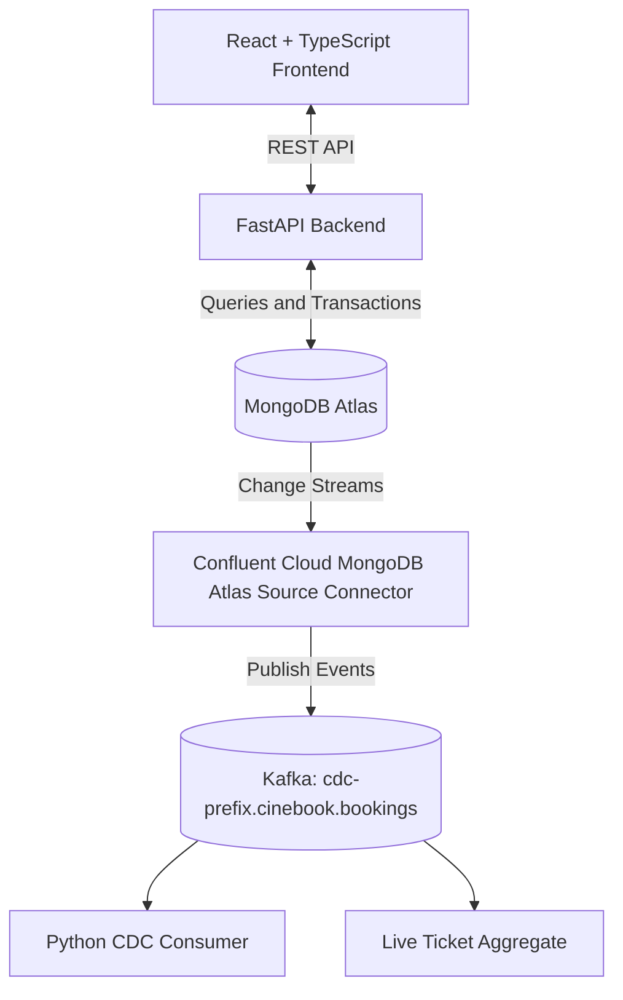

# CineBook — System Architecture

```mermaid
flowchart TD
    A["React + TypeScript Frontend"]
    B["FastAPI Backend"]
    C[("MongoDB Atlas")]
    D["Confluent Cloud MongoDB Atlas Source Connector"]
    E[("Kafka: cdc-prefix.cinebook.bookings")]
    F["Python CDC Consumer"]
    G["Live Ticket Aggregate"]

    A <-->|REST API| B
    B <-->|Queries and Transactions| C
    C -->|Change Streams| D
    D -->|Publish Events| E
    E --> F
    E --> G
```
